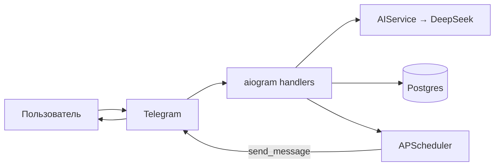

# Smart Reminder Bot

[](https://www.python.org/)
[](LICENSE)
[](https://github.com/TheRoviks/GeoLocus-AI/actions/workflows/ci.yml)

Telegram-бот, который понимает напоминания на естественном языке через DeepSeek AI и шлёт их точно в срок.

```
Я: напомни купить молоко завтра в 19:00
Бот: ✅ Запомнил!
     📝 купить молоко
     🕐 Сб, 9 мая в 19:00
```

## Возможности

- 🧠 **Естественный язык** — «через 2 часа», «каждый понедельник в 9 утра», «завтра вечером»
- 🔁 **Повторяющиеся** — daily / weekly:DAY / monthly:N
- 🌙 **Тихие часы** — переносит уведомление на утро если приходит ночью
- 🌍 **Часовой пояс** — на пользователя
- 📋 `/list` с пагинацией, `/stats`, `/settings`

## Быстрый старт

```bash
cp .env.example .env
# впиши BOT_TOKEN (от @BotFather) и DEEPSEEK_API_KEY (с platform.deepseek.com)
docker compose up
```

Готово — бот стартует и применяет миграции автоматически.

## Переменные окружения

| Переменная | Описание | По умолчанию |
|---|---|---|
| `BOT_TOKEN` | Токен от @BotFather | — (обязательно) |
| `DEEPSEEK_API_KEY` | Ключ DeepSeek | — (обязательно) |
| `DEEPSEEK_MODEL` | Имя модели | `deepseek-chat` |
| `DEEPSEEK_BASE_URL` | API endpoint | `https://api.deepseek.com` |
| `DATABASE_URL` | DSN Postgres | (из compose) |
| `POSTGRES_USER` | Пользователь Postgres (только compose) | `postgres` |
| `POSTGRES_PASSWORD` | Пароль Postgres (только compose) | — |
| `POSTGRES_DB` | Имя БД (только compose) | `reminders` |
| `DEFAULT_TIMEZONE` | TZ по умолчанию | `Europe/Moscow` |
| `DEBUG` | Debug-логи + echo SQL | `false` |
| `LOG_LEVEL` | `DEBUG`/`INFO`/`WARNING`/`ERROR` | `INFO` |

## Архитектура



- **bot/** — handlers, middlewares (auth, throttling), keyboards
- **services/** — AI, reminder CRUD, scheduler, recurrence, quiet-hours
- **models/** — SQLAlchemy 2 (async)
- **db/** — Alembic + session factory
- **core/** — config (pydantic), structlog, exceptions, строки UI

## Разработка

```bash
pip install -r requirements-dev.txt
ruff check .
mypy services models core
pytest
```

Покрытие тестами `services/` ≥ 80% (фейлится в CI если ниже).

## Contributing

PR приветствуются. Перед отправкой:

- `pytest` должен быть зелёным
- `ruff check .` без ошибок
- `mypy services models core` без ошибок

## Лицензия

MIT
